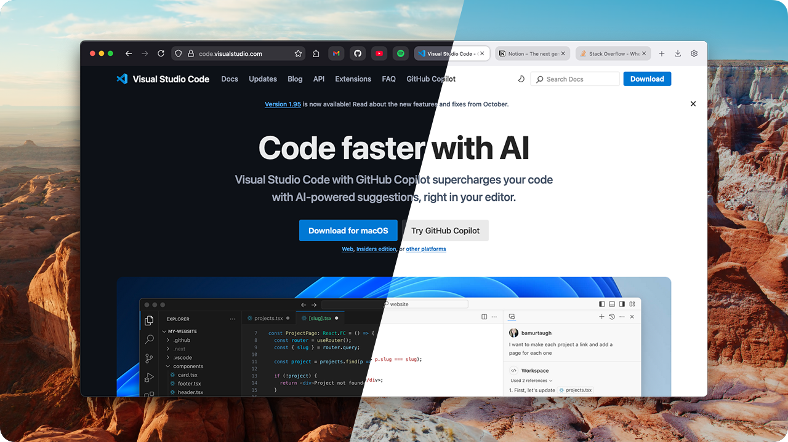
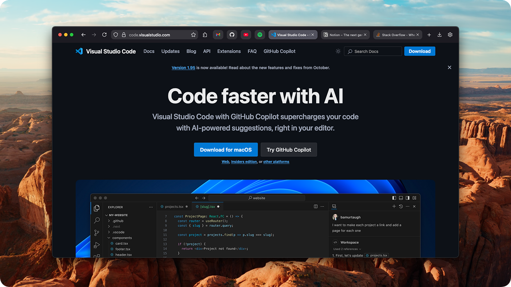
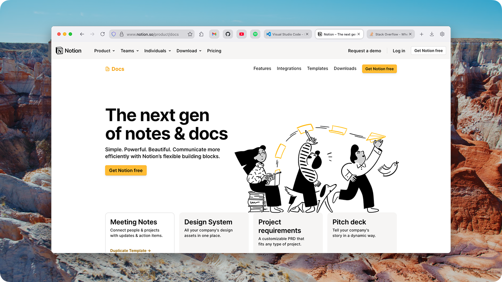
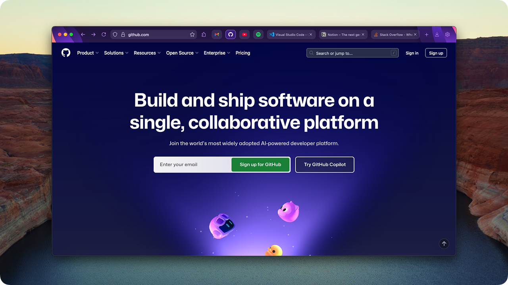

  

<h1 align="center">Firefox Compact UI</h1>

Minimalistic one-line user interface for Firefox Browser.

  <a href="https://github.com/ivodolenc/firefox-compact">Repository</a>
  ✦
  <a href="https://github.com/ivodolenc/firefox-compact/releases">Releases</a>
  ✦
  <a href="https://github.com/ivodolenc/firefox-compact/discussions">Discussions</a>

 

  Special Sponsor

  

 

## Features

- Adds compact modern style
- Provides a more rounded look
- Allows native toolbar customization
- Supports all color themes

## Installation

1. Open the Firefox browser.

2. Type `about:config` in the address bar and open the config page.

   - Search for preference name `toolkit.legacyUserProfileCustomizations.stylesheets` and set it to `true`.

3. Type `about:support` in the address bar and open the support page.

   - Find the `Profile Folder` on the left and click `Show in Finder` button to open the `Profile` directory.
   - Download the `chrome` directory from the latest [release](https://github.com/ivodolenc/firefox-compact/releases) and copy it to your previously opened `Profile` directory.

4. Restart Firefox to apply the `Compact UI` changes.

Read the official <a href="https://support.mozilla.org/en-US/kb/contributors-guide-firefox-advanced-customization">guide</a> to learn more about Firefox Configuration.

## Color Themes

**Firefox Compact UI** is designed to natively support all color themes.

Check out some of the themes that come with the browser below.

### Dark Theme

  

### Light Theme

  

### Alpenglow Theme

  

## Community

Feel free to ask questions or share new ideas.

Use the official [discussions](https://github.com/ivodolenc/firefox-compact/discussions) to get involved.

## License

Developed in 🇭🇷 Croatia, © Ivo Dolenc.

Released under the [MIT](LICENSE.txt) license.
